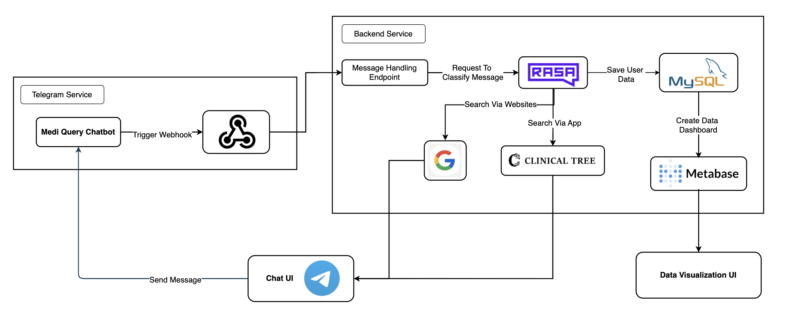

# FA Med Chatbot

FA Med Chatbot is a medical chatbot designed to assist users in getting quick medical information and support. The chatbot is built using Go and can be deployed using Docker.

## Table of Contents
- [Introduction](#introduction)
- [Telegram Bot](#telegram-bot)
- [Docker](#docker)


## Introduction

FA Med Chatbot is a Telegram bot developed using the Gin framework and Telegram Bot API. It is specifically designed to assist medical students in retrieving documents and information. The bot leverages Google’s Custom Search API to provide accurate and relevant search results, making it a valuable tool for medical education and research.

## Telegram Bot
You can interact with the FA Med Chatbot on Telegram through the following link: [FA Med Chatbot](https://t.me/ClinicalTreeSearch_bot)

## Architecture



## Docker

To deploy the CVSeeker application using Docker Compose, follow these steps:

1. **Ensure Docker and Docker Compose are installed on your system.**

2. **Clone the repository:**
    ```sh
    git clone https://github.com/tunghng/CVSeeker.git
    cd CVSeeker
    ```

3. **Build and start the containers:**
    ```sh
    docker-compose up --build
    ```

4. **Stop the containers:**
    ```sh
    docker-compose down
    ```
